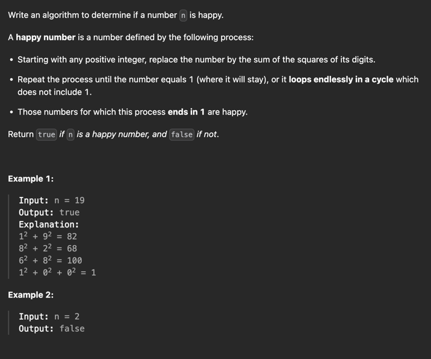

https://leetcode.com/problems/happy-number/?envType=study-plan-v2&envId=top-interview-150

Interesting solution from the discussion using BitSet instead of HashMap:
- https://leetcode.com/problems/happy-number/solutions/3478332/detect-cycles-with-a-bitset-instead-of-hashmap-with-o-1-space/?envType=study-plan-v2&envId=top-interview-150
- https://leetcode.com/problems/sum-of-two-integers/solutions/84278/A-summary:-how-to-use-bit-manipulation-to-solve-problems-easily-and-efficiently/