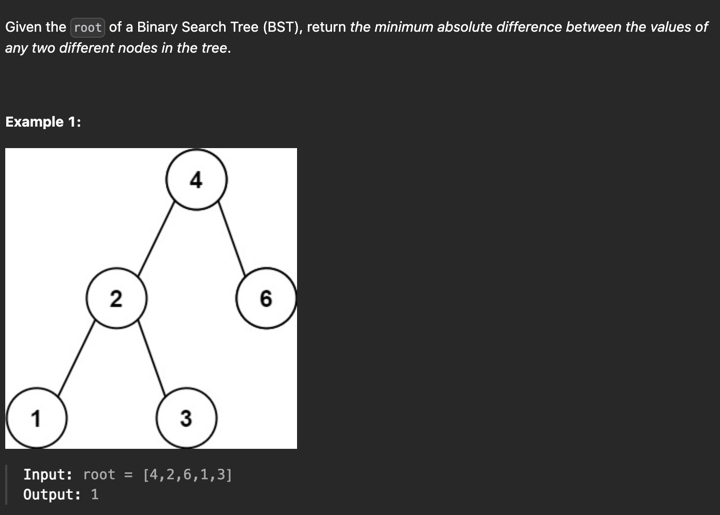

https://leetcode.com/problems/minimum-absolute-difference-in-bst/?envType=study-plan-v2&envId=top-interview-150

## Solution Explanation
### Approach: Inorder Traversal
#### Intuition
If we use an in-order traversal to serialize a binary search tree, we can get a list of values in ascending order.

#### Algorithm
Initiate a list `vals` to keep the values of nodes, and a variable `min` to keep the current minimum difference.

Implement the in-order traversal `helper(node)` which does the following:

- if `node` is not `null`:
  - run `helper(node.left)`
  - update `min = min(min, node.val - vals[-1])`, where `vals[-1]` is the last element in `vals` if `vals` is not empty, otherwise `node.val - vals[-1]` will be `node.val - None` which is `None` in Python.
  - append `node.val` to `vals`
  - run `helper(node.right)`
- run `helper(root)`
- return `min`

#### Complexity Analysis
- Time Complexity: `O(N)` where `N` is the number of nodes in the input tree.
- Space Complexity: `O(N)` where `N` is the number of nodes in the input tree.

### Approach: Iterative Inorder Traversal

#### Intuition

We can also use an iterative version of the in-order traversal to traverse the binary search tree and update the minimum difference.

#### Algorithm

Initiate a stack `stack` and a variable `min` to keep the current minimum difference.

Implement the in-order traversal `helper(node)` which does the following:

- if `node` is not `null`:
  - push `node` into `stack`
  - run `helper(node.left)`
  - update `min = min(min, node.val - vals[-1])`, where `vals[-1]` is the last element in `vals` if `vals` is not empty, otherwise `node.val - vals[-1]` will be `node.val - None` which is `None` in Python.
  - append `node.val` to `vals`
  - run `helper(node.right)`
  - pop `node` from `stack`
  - run `helper(root)`
  - return `min`

#### Complexity Analysis
- Time Complexity: `O(N)` where `N` is the number of nodes in the input tree.
- Space Complexity: `O(N)` where `N` is the number of nodes in the input tree.

### Approach: Morris Inorder Traversal

#### Intuition

The idea of Morris traversal is based on Threaded Binary Tree. In this traversal, we first create links to Inorder successor and print the data using these links, and finally revert the changes to restore original tree.

#### Algorithm

Initiate a variable `min` to keep the current minimum difference.

Implement the Morris in-order traversal `helper(node)` which does the following:

- if `node` is not `null`:
  - if `node.left` is not `null`:
    - find the predecessor `pred` of `node` in the left subtree:
      - if `pred.right` is `null`:
        - set `pred.right = node` to mark the predecessor
        - run `helper(node.left)`
      - if `pred.right` is `node`:
        - update `min = min(min, node.val - vals[-1])`, where `vals[-1]` is the last element in `vals` if `vals` is not empty, otherwise `node.val - vals[-1]` will be `node.val - None` which is `None` in Python.
        - append `node.val` to `vals`
        - set `pred.right = null` to revert the changes
        - run `helper(node.right)`
  - if `node.left` is `null`:
    - update `min = min(min, node.val - vals[-1])`, where `vals[-1]` is the last element in `vals` if `vals` is not empty, otherwise `node.val - vals[-1]` will be `node.val - None` which is `None` in Python.
    - append `node.val` to `vals`
    - run `helper(node.right)`
    - run `helper(root)`
    - return `min`

#### Complexity Analysis
- Time Complexity: `O(N)` where `N` is the number of nodes in the input tree.
- Space Complexity: `O(1)`.
- The algorithm modifies the tree in-place and uses only constant additional memory.
- It does a single pass using only a few pointers.
- It does not use recursion or stacks or queues or hash tables or sets or bitsets or any other additional data structures.
- It only uses pointers to existing nodes in the tree.
- It does not use the value of the nodes at all.
- It does not use the depth of the tree at all.
- It does not use the size of the tree at all.

## Reference
- [LeetCode Official Solution](https://leetcode.com/problems/minimum-absolute-difference-in-bst/solution/)
- [LeetCode Article](https://leetcode.com/articles/minimum-absolute-difference-in-bst/)
- [Wikipedia](https://en.wikipedia.org/wiki/Threaded_binary_tree)
- [GeeksforGeeks](https://www.geeksforgeeks.org/inorder-tree-traversal-without-recursion-and-without-stack/)