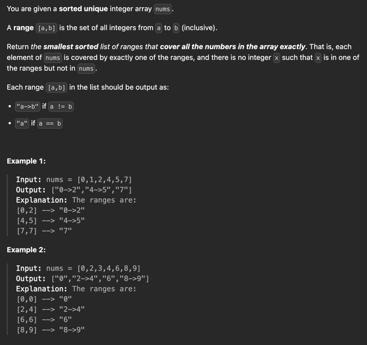
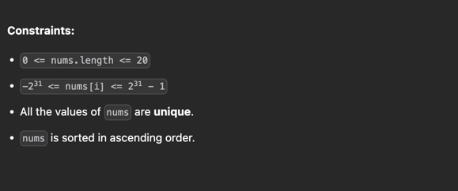
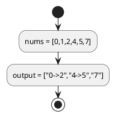

https://leetcode.com/problems/summary-ranges/description/?envType=study-plan-v2&envId=top-interview-150

```plantuml
@startuml
start
:nums = [0,1,2,4,5,7];
:output = ["0->2","4->5","7"];
stop
@enduml
```